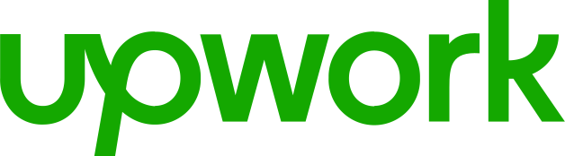

<h2 align=center> Hi👋, I'm Akifa Batool</h2>
<h3 align=center>I am a passionate data scientist who is zealeous about turing data into meaningful insights.</h3>

Hi! I have a deep fascination with the world of data and mathematics. My journey began with an intense curiosity about how data can be used to tell compelling stories and solve complex problems. This passion has led me to focus on data science, where I delve into machine learning, statistical analysis, and big data to uncover insights and drive decision-making. I'm committed to staying at the forefront of this field by continuously learning and experimenting with new technologies and methodologies.

In addition to my focus on data science, I'm also learning the MERN stack to build dynamic and responsive web applications. Furthermore, I have a growing interest in cybersecurity, aiming to ensure that the solutions I create are not only innovative but also secure. By integrating these diverse skills, I aspire to develop comprehensive and robust data-driven solutions that can address real-world challenges. Feel free to explore my projects and connect with me!

- 🔭 I’m currently working on **Data Science**
- 🌱 I’m currently learning **Deep learning** and **MERN Stack**
- 👯 I’m looking to collaborate on Data Science projects.
- 💬 Ask me about **Data**

<h3 align="left">Connect with me:</h3>

<h3 align="left">Hire me for work</h3>

<h3 align="left">Languages and Tools:</h3>

<a href="https://www.w3schools.com/css/" target="_blank" rel="noreferrer">

